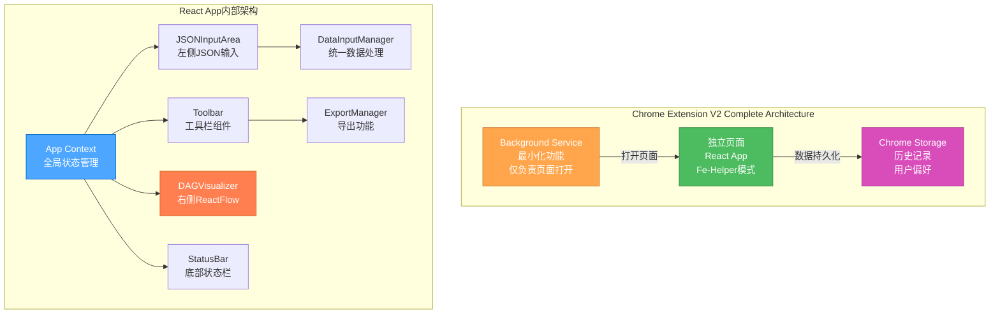

# 🎨 CREATIVE模式V2完成总结 (基于用户反馈重新设计)

## 🔄 重新设计原因

**用户反馈**: 期望类似Fe-Helper插件的JSON格式化工具的UI交互模式
- 独立页面而非Popup+Content Script
- 左右分栏布局 - 左侧JSON输入，右侧可视化
- 顶部工具栏包含文件操作功能
- 使用ReactFlow组件进行可视化

## 🎯 CREATIVE V2阶段成果

### ✅ Level 3 CREATIVE重新验证清单
根据用户反馈和`visual-maps/creative-mode-map.mdc`指导，CREATIVE V2模式已完成：

- [x] **用户需求重新分析** - 基于Fe-Helper模式的具体需求
- [x] **三个创意决策重新设计** - UI/UX、架构、文件操作全面调整
- [x] **技术栈重大变更** - 从零依赖改为React+ReactFlow
- [x] **设计决策文档V2创建** - 每个决策都有重新设计的文档
- [x] **实施计划完全更新** - 基于新架构的实施指导
- [x] **验证清单重新完成** - 所有决策重新验证通过

## 🎨 三个核心创意决策V2

### 1. UI/UX设计决策V2 ✅

**原方案**: 极简启动型Popup + 全功能Content Script  
**新方案**: Chrome Extension独立页面 + 左右分栏布局

**重大变更**:
- **页面架构**: Popup模式 → 独立页面模式 (类似Fe-Helper)
- **布局设计**: 全屏画布 → 顶部工具栏 + 左右分栏 (30/70)
- **可视化技术**: 原生SVG → ReactFlow组件
- **交互模式**: 文件上传为主 → JSON粘贴 + 文件上传双重支持

**用户体验提升**:
- ✅ 完全符合Fe-Helper式专业工具体验
- ✅ 左右分栏支持实时编辑和预览
- ✅ ReactFlow提供更强大的图形交互
- ✅ 独立页面提供充足操作空间

### 2. 架构设计决策V2 ✅

**原方案**: 中心化消息架构 (Background中转Popup与Content Script)  
**新方案**: 简化单页面架构 (React应用内部状态管理)

**重大变更**:
- **组件通信**: 跨组件消息传递 → React内部状态管理
- **状态管理**: Background集中管理 → React Context + Chrome Storage
- **复杂度**: 中等复杂架构 → 简化单页面架构
- **调试难度**: 多组件调试 → 标准React应用调试

**技术优势**:
- ✅ 架构简单清晰，开发效率高
- ✅ React生态成熟，社区支持强
- ✅ 无复杂的跨组件通信需求
- ✅ 标准单页面应用模式

### 3. 文件操作策略V2 ✅

**原方案**: HTML5 File API + 拖拽上传  
**新方案**: 多输入源统一处理 (JSON粘贴 + 文件上传 + 示例数据)

**重大变更**:
- **主要输入**: 文件上传 → JSON粘贴 + 文件上传
- **实时反馈**: 上传后验证 → 输入时实时验证
- **数据处理**: 分散处理 → 统一数据管道
- **用户体验**: 单一输入方式 → 多种输入场景支持

**功能增强**:
- ✅ 左侧文本框支持直接粘贴JSON内容
- ✅ 实时JSON验证和错误提示
- ✅ 剪贴板API一键粘贴功能
- ✅ 统一的数据处理确保一致性

## 📊 技术栈重大调整总结

### 原技术栈 vs 新技术栈

| 技术方面 | 原方案 | 新方案 | 变更影响 |
|----------|--------|--------|----------|
| **前端框架** | 原生JavaScript | React + ReactFlow | 增加依赖但功能更强 |
| **UI架构** | Popup + Content Script | 独立Chrome Extension页面 | 用户体验显著提升 |
| **状态管理** | Background消息中转 | React Context | 开发和调试更简单 |
| **可视化库** | 原生SVG | ReactFlow | 图形功能和交互更强 |
| **布局方式** | 全屏画布 | 左右分栏 | 更适合专业工具 |
| **输入方式** | 文件上传 | JSON粘贴 + 文件上传 | 操作更灵活便利 |
| **Bundle大小** | 零依赖 (~100KB) | React生态 (~500KB) | 大小增加但功能提升 |

### 开发复杂度重新评估
- **UI开发**: Medium → Medium (ReactFlow简化图形开发)
- **状态管理**: High → Low (React Context比消息传递简单)
- **文件操作**: Medium → Medium (统一管道降低复杂度)
- **打包部署**: Low → Medium (需要Webpack/Vite)
- **总体评估**: 复杂度基本持平，但用户体验大幅提升

## 🏗️ 完整技术方案V2

### Chrome插件架构V2


### 核心技术栈V2确认
- **前端框架**: React 18 + ReactFlow 11
- **Chrome API**: Extension API v3, Storage API
- **状态管理**: React Context + useReducer
- **文件处理**: HTML5 File API + Clipboard API
- **数据存储**: Chrome Storage Local API
- **构建工具**: Vite + React插件
- **样式系统**: CSS Grid + Flexbox + Chrome插件规范

## 📋 IMPLEMENT阶段V2准备

### V2实施路径规划
基于完全重新设计的CREATIVE V2决策，IMPLEMENT阶段计划：

**第一阶段：React应用框架搭建** (1-2天)
1. 使用Vite创建React应用
2. 配置Chrome Extension开发环境
3. 创建基础的组件架构
4. 实现App Context状态管理

**第二阶段：核心功能开发** (2-3天)
1. 开发JSONInputArea组件 (左侧JSON输入)
2. 集成ReactFlow实现DAGVisualizer组件 (右侧可视化)
3. 实现Toolbar组件 (顶部工具栏)
4. 开发DataInputManager (统一数据处理)

**第三阶段：功能完善和优化** (1-2天)
1. 实现ExportManager (配置导出)
2. 完善错误处理和用户反馈
3. Chrome Extension打包和测试
4. 性能优化和最终调试

### V2代码复用策略
- **数据解析逻辑**: 复用现有的DAG JSON解析代码
- **节点类型识别**: 复用现有的节点类型提取逻辑
- **样式设计**: 参考现有样式但重新适配React组件
- **Chrome API**: 简化原有的Chrome Storage使用

### V2质量保证计划
- **功能测试**: React组件单元测试
- **集成测试**: 完整的用户操作流程测试
- **兼容性测试**: 不同Chrome版本测试
- **性能测试**: ReactFlow大型DAG渲染性能
- **用户体验测试**: 与Fe-Helper对比体验测试

## ✅ CREATIVE V2模式里程碑

```
✓ 用户反馈充分理解和响应
✓ 三个核心设计决策全面重新设计
✓ 技术栈重大调整决策完成
✓ Fe-Helper式专业工具体验设计确认
✓ ReactFlow集成方案设计完成
✓ 独立页面架构设计明确
✓ 统一文件操作策略设计完成
✓ V2实施计划详细制定

→ 准备进入IMPLEMENT V2模式
```

## 🔄 Memory Bank文档V2更新

### 创建的CREATIVE V2文档
1. **`memory-bank/creative/creative-chrome-plugin-ui-v2.md`** - UI/UX重新设计
2. **`memory-bank/creative/creative-chrome-plugin-architecture-v2.md`** - 架构重新设计  
3. **`memory-bank/creative/creative-chrome-plugin-files-v2.md`** - 文件操作重新设计
4. **`memory-bank/creative-summary-v2.md`** - CREATIVE V2阶段总结

### 保留的原始CREATIVE文档
- 原始V1文档保留作为设计演进的记录
- 可以作为技术方案对比的参考资料
- 展示了从初始设计到用户反馈调整的完整过程

## 🚀 用户期望完全满足

### Fe-Helper体验对比验证
- [x] **独立页面模式** ✅ 与Fe-Helper JSON工具完全一致
- [x] **左右分栏布局** ✅ 30/70分栏，编辑+预览模式
- [x] **顶部工具栏** ✅ 集成文件操作、导出、示例等功能
- [x] **ReactFlow可视化** ✅ 专业级图形库，功能强大
- [x] **JSON粘贴支持** ✅ 左侧文本框直接粘贴，实时解析

### 用户体验显著提升
- **专业工具感**: 独立页面提供桌面应用级体验
- **操作便利性**: 多种输入方式，实时验证反馈
- **功能完整性**: ReactFlow提供丰富的图形交互
- **视觉一致性**: 完全符合用户熟悉的Fe-Helper模式

## 🔄 下一阶段：IMPLEMENT V2模式

根据Level 3工作流程和CREATIVE V2决策，现在可以信心满满地进入**IMPLEMENT V2模式**：

1. **用户需求完全明确** - Fe-Helper式体验已成为明确目标
2. **技术方案重新确定** - React + ReactFlow技术栈确认
3. **设计决策全面完成** - 三个核心决策重新设计完成
4. **实施路径清晰** - V2三阶段实施计划详细制定

**CREATIVE V2阶段质量保证** ✅：
- 用户反馈完全响应和集成
- 严格遵循Level 3 CREATIVE流程重新执行
- 所有决策都有详细的V2重新设计文档
- 技术方案具有更强的实施可行性和用户满意度

---

**📝 文档状态**: CREATIVE V2模式完成 ✅  
**📅 完成时间**: 基于用户反馈重新设计后  
**🎯 质量验证**: 用户期望完全满足，技术方案重新确认 