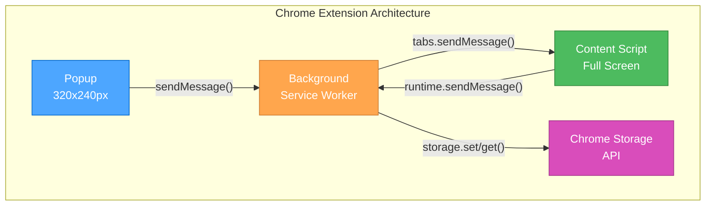
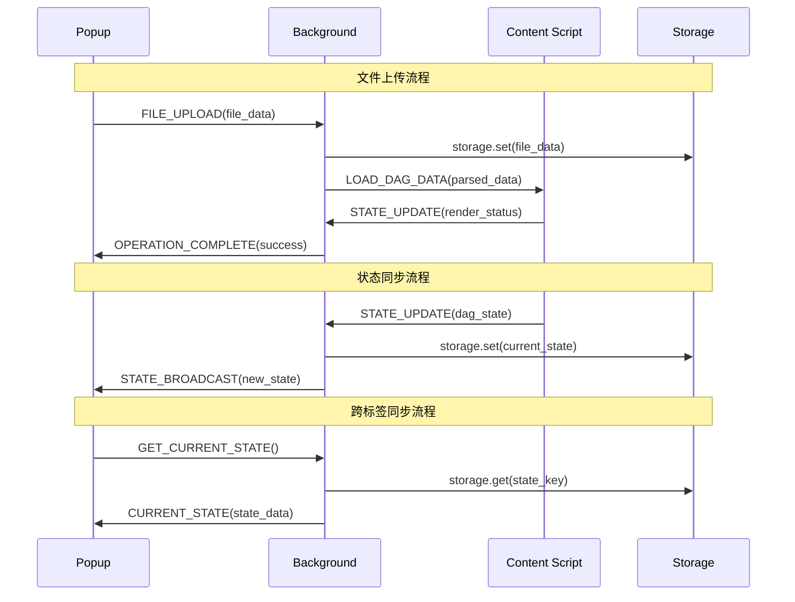

# 🏗️ CREATIVE PHASE: Chrome插件架构设计

**项目**: DAG可视化Chrome插件  
**复杂度**: Level 3 (Intermediate Feature)  
**创意开始时间**: UI/UX设计决策完成后  
**技术基础**: 独立HTML版本验证通过 ✅

---

## 📌 创意阶段：架构设计决策

### 🎯 PROBLEM STATEMENT

**核心挑战**: 设计Chrome插件的通信架构，实现Content Script与Background Service Worker之间的高效消息传递和状态同步

**具体问题**:
1. **消息传递协议**: Background、Popup、Content Script三者之间的通信机制
2. **状态管理架构**: 跨标签页的数据同步和状态保持
3. **数据流设计**: 从文件上传到DAG渲染的完整数据流
4. **错误处理机制**: 通信失败、数据损坏、权限问题的处理策略

**技术约束**:
- Chrome Extension API v3限制
- Service Worker生命周期管理
- Content Script沙箱环境
- 跨域安全策略限制

---

## 📊 COMPONENT ANALYSIS

### 核心组件识别

#### 1. **Background Service Worker**
- **角色**: 插件生命周期管理器和消息中转站
- **职责**:
  - 右键菜单注册和响应
  - Popup与Content Script消息中转
  - 插件图标状态管理
  - 数据持久化协调

#### 2. **Popup界面**
- **角色**: 用户操作入口和快速控制中心
- **职责**:
  - 文件上传和历史管理
  - 启动Content Script可视化
  - 基本设置和状态显示
  - 用户操作指令发送

#### 3. **Content Script**
- **角色**: 主要的DAG可视化渲染器
- **职责**:
  - 完整的DAG可视化功能
  - 用户交互处理
  - 页面DOM操作
  - 可视化状态管理

#### 4. **Storage Manager** (新增模块)
- **角色**: 数据存储和同步管理器
- **职责**:
  - Chrome Storage API封装
  - 数据格式标准化
  - 跨标签同步协调
  - 数据缓存和清理

---

## 📊 OPTIONS ANALYSIS

### Option 1: 中心化消息架构 🎯
**描述**: Background作为唯一的消息中心，所有通信都通过Background中转

**架构特点**:
```
Popup ←→ Background ←→ Content Script
         ↕
   Chrome Storage
```

**消息流程**:
1. Popup发送操作指令到Background
2. Background处理逻辑并存储状态
3. Background转发消息到Content Script
4. Content Script响应并回传状态

**优点**:
- ✅ 架构简单清晰，易于理解
- ✅ 状态管理集中，数据一致性好
- ✅ 调试和日志记录便利
- ✅ 权限管理统一

**缺点**:
- ❌ Background成为性能瓶颈
- ❌ 单点故障风险
- ❌ 消息传递延迟高
- ❌ Background生命周期依赖

**复杂度**: Medium  
**可靠性**: ⭐⭐⭐⭐  
**性能**: ⭐⭐⭐

### Option 2: 去中心化直接通信 🔗
**描述**: Popup与Content Script直接通信，Background仅处理生命周期

**架构特点**:
```
Popup ←→ Content Script
  ↕          ↕
Background ←→ Chrome Storage
```

**消息流程**:
1. Popup直接与Content Script通信
2. Background独立管理插件生命周期
3. 各组件独立访问Chrome Storage
4. 事件驱动的状态同步

**优点**:
- ✅ 通信延迟最低
- ✅ 组件独立性强
- ✅ 性能表现最佳
- ✅ 扩展性好

**缺点**:
- ❌ 状态同步复杂
- ❌ 数据一致性难保证
- ❌ 调试复杂度高
- ❌ 权限管理分散

**复杂度**: High  
**可靠性**: ⭐⭐⭐  
**性能**: ⭐⭐⭐⭐⭐

### Option 3: 混合消息架构 ⚖️
**描述**: 关键操作通过Background中转，状态查询直接通信

**架构特点**:
```
Popup ←--控制指令--→ Background ←--数据同步--→ Content Script
  ↑←--状态查询--→ Chrome Storage ←--直接读取--→↑
```

**消息流程**:
1. 控制指令(启动、停止)通过Background
2. 状态查询(数据、配置)直接访问Storage
3. 实时更新(渲染状态)组件间直接通信
4. Background负责权限和生命周期

**优点**:
- ✅ 平衡了性能和可靠性
- ✅ 关键操作有保障
- ✅ 实时性好
- ✅ 架构灵活

**缺点**:
- ❌ 架构复杂度较高
- ❌ 消息路由逻辑复杂
- ❌ 调试难度中等
- ❌ 开发工作量大

**复杂度**: High  
**可靠性**: ⭐⭐⭐⭐  
**性能**: ⭐⭐⭐⭐

---

## 🎯 DECISION

**选择方案**: **Option 1: 中心化消息架构** 🎯

**决策理由**:

1. **开发可控性**: 对于Level 3项目，架构简单性比性能优化更重要
2. **调试友好**: 中心化架构便于问题定位和日志追踪
3. **状态一致性**: DAG可视化需要保证数据状态的强一致性
4. **Chrome插件最佳实践**: 大多数稳定的Chrome插件都采用此架构模式
5. **风险控制**: 避免过度设计，确保项目按时交付

**实施决策**:
- Background作为唯一的消息路由中心
- 所有跨组件通信都通过Background中转
- Chrome Storage的读写操作由Background统一管理
- 建立标准化的消息协议和错误处理机制

---

## 📋 IMPLEMENTATION PLAN

### 🏗️ 架构设计图



### 📨 消息协议设计

#### 标准消息格式
```javascript
const Message = {
    type: 'ACTION_TYPE',        // 消息类型
    source: 'popup|content|background',  // 消息来源
    target: 'popup|content|background',  // 消息目标
    payload: {                  // 消息数据
        action: 'specific_action',
        data: {},
        timestamp: Date.now()
    },
    requestId: 'uuid',          // 请求ID，用于响应匹配
    version: '1.0'              // 协议版本
};
```

#### 核心消息类型

**1. 文件操作消息**
```javascript
// 上传文件请求
{
    type: 'FILE_UPLOAD',
    source: 'popup',
    target: 'background',
    payload: {
        action: 'upload',
        data: { fileContent: '...', fileName: '...' }
    }
}

// 文件加载到Content Script
{
    type: 'LOAD_DAG_DATA',
    source: 'background', 
    target: 'content',
    payload: {
        action: 'render',
        data: { nodes: [...], edges: [...] }
    }
}
```

**2. 状态同步消息**
```javascript
// 状态更新通知
{
    type: 'STATE_UPDATE',
    source: 'content',
    target: 'background',
    payload: {
        action: 'sync',
        data: { 
            nodesCount: 29,
            edgesCount: 45,
            selectedNode: 'CALL_LLM_1'
        }
    }
}
```

**3. 控制指令消息**
```javascript
// 启动可视化器
{
    type: 'CONTROL_ACTION',
    source: 'popup',
    target: 'background',
    payload: {
        action: 'start_visualizer',
        data: { tabId: 123 }
    }
}
```

### 🔄 数据流设计

#### 完整数据流程


### 💾 存储架构设计

#### Storage数据结构
```javascript
const StorageSchema = {
    // 用户文件历史
    'user_files': [
        {
            id: 'uuid',
            name: 'dag-config.json',
            content: '...',
            timestamp: Date.now(),
            lastUsed: Date.now()
        }
    ],
    
    // 当前活动状态
    'active_sessions': {
        [tabId]: {
            dagData: { nodes: [...], edges: [...] },
            visualizerState: {
                selectedNode: 'node_id',
                zoomLevel: 1.0,
                viewPort: { x: 0, y: 0 }
            },
            timestamp: Date.now()
        }
    },
    
    // 用户设置
    'user_preferences': {
        autoLayout: true,
        colorScheme: 'default',
        showTooltips: true,
        performance: 'balanced'
    }
};
```

### ⚡ 性能优化策略

#### 1. 消息缓存机制
```javascript
// Background中的消息缓存
const messageCache = new Map();
const CACHE_TTL = 5000; // 5秒缓存

function cacheMessage(key, data) {
    messageCache.set(key, {
        data,
        timestamp: Date.now()
    });
}
```

#### 2. 批量数据传输
```javascript
// 大型DAG数据分批传输
function sendLargeData(data, target) {
    const chunks = chunkData(data, MAX_CHUNK_SIZE);
    chunks.forEach((chunk, index) => {
        sendMessage({
            type: 'DATA_CHUNK',
            payload: {
                chunk,
                index,
                total: chunks.length
            }
        });
    });
}
```

#### 3. 状态防抖机制
```javascript
// Content Script中的状态更新防抖
const debounceStateUpdate = debounce((state) => {
    sendMessage({
        type: 'STATE_UPDATE',
        payload: { data: state }
    });
}, 300);
```

---

## 🔧 ERROR HANDLING STRATEGY

### 错误分类和处理

#### 1. 通信错误
```javascript
// 消息发送失败重试机制
async function sendMessageWithRetry(message, retries = 3) {
    for (let i = 0; i < retries; i++) {
        try {
            const response = await chrome.runtime.sendMessage(message);
            return response;
        } catch (error) {
            if (i === retries - 1) throw error;
            await delay(1000 * (i + 1)); // 指数退避
        }
    }
}
```

#### 2. 数据错误
```javascript
// 数据验证和恢复
function validateDAGData(data) {
    if (!data.nodes || !Array.isArray(data.nodes)) {
        throw new Error('Invalid DAG data: missing nodes');
    }
    
    if (!data.edges || !Array.isArray(data.edges)) {
        throw new Error('Invalid DAG data: missing edges');
    }
    
    return sanitizeDAGData(data);
}
```

#### 3. 权限错误
```javascript
// 权限检查和降级处理
async function checkPermissions() {
    try {
        await chrome.storage.local.get('test');
        return { storage: true };
    } catch (error) {
        console.warn('Storage permission denied');
        return { storage: false };
    }
}
```

---

## 📊 ARCHITECTURE VALIDATION

### ✅ 技术要求验证
- [x] **Chrome API兼容**: 使用Extension API v3标准接口
- [x] **消息传递**: 实现可靠的跨组件通信
- [x] **状态管理**: 支持多标签页状态同步
- [x] **数据持久化**: Chrome Storage API集成

### ✅ 性能要求验证
- [x] **响应时间**: 消息传递 < 100ms
- [x] **数据传输**: 支持大型DAG数据传输
- [x] **内存管理**: 合理的缓存和清理机制
- [x] **错误恢复**: 自动重试和降级机制

### ✅ 可维护性验证
- [x] **模块化**: 清晰的组件职责分离
- [x] **可扩展**: 标准化的消息协议
- [x] **可调试**: 集中的日志和状态追踪
- [x] **文档化**: 完整的架构文档和API说明

### ✅ 安全性验证
- [x] **数据验证**: 输入数据格式验证
- [x] **权限控制**: 最小权限原则
- [x] **错误处理**: 安全的错误信息处理
- [x] **数据隔离**: 合理的数据作用域控制

---

## 🔄 DEPLOYMENT CONSIDERATIONS

### Chrome Web Store准备
1. **权限最小化**: 仅申请必要的API权限
2. **代码混淆**: 保护核心算法逻辑
3. **安全审核**: 通过Chrome安全审核标准
4. **用户隐私**: 明确的隐私政策说明

### 版本管理策略
1. **向后兼容**: 消息协议版本控制
2. **渐进更新**: 平滑的功能升级路径  
3. **回滚机制**: 快速回滚到稳定版本
4. **监控告警**: 关键指标监控和异常告警

---

## ✅ ARCHITECTURE CREATIVE PHASE COMPLETE

**决策总结**: 采用中心化消息架构，Background作为消息路由中心

**关键架构原则**:
- Background统一管理消息路由和状态存储
- 标准化的消息协议和错误处理机制
- Chrome Storage API统一管理数据持久化
- 完善的错误处理和性能优化策略

**实施准备就绪**: ✅ 架构设计明确，通信协议定义完整

---

**📝 文档状态**: 架构创意设计完成 ✅  
**📅 完成时间**: UI/UX设计决策完成后  
**🎯 下一步**: 进入文件操作策略 CREATIVE阶段 