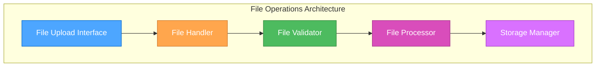

# 📁 CREATIVE PHASE: Chrome插件文件操作策略

**项目**: DAG可视化Chrome插件  
**复杂度**: Level 3 (Intermediate Feature)  
**创意开始时间**: 架构设计决策完成后  
**技术基础**: 中心化消息架构 ✅

---

## 📌 创意阶段：文件操作策略决策

### 🎯 PROBLEM STATEMENT

**核心挑战**: 设计Chrome插件环境下的文件访问方案，在确保安全性的同时提供良好的用户体验

**具体问题**:
1. **文件读取方案**: Chrome插件环境下的本地文件访问限制和解决方案
2. **安全性平衡**: 在Chrome安全沙箱中实现文件操作的安全策略
3. **用户体验优化**: 简化文件上传流程，支持多种文件输入方式
4. **数据隐私保护**: 确保用户DAG数据的隐私和安全

**技术约束**:
- Chrome Extension安全策略限制
- 文件系统访问权限控制
- Content Security Policy (CSP) 限制
- 用户隐私保护要求

---

## 📊 OPTIONS ANALYSIS

### Option 1: Chrome File System API 📂
**描述**: 使用Chrome的File System Access API获取文件系统权限

**技术特点**:
- API: `window.showOpenFilePicker()`
- 权限: 需要用户主动授权
- 支持: Chrome 86+
- 安全: 用户完全控制文件选择

**实现方式**:
```javascript
// Popup中触发文件选择
async function selectFile() {
    const [fileHandle] = await window.showOpenFilePicker({
        types: [{
            description: 'JSON files',
            accept: { 'application/json': ['.json'] }
        }]
    });
    const file = await fileHandle.getFile();
    const content = await file.text();
    return { name: file.name, content };
}
```

**优点**:
- ✅ 原生API支持，性能最佳
- ✅ 用户体验流畅，类似桌面应用
- ✅ 安全性最高，用户主动授权
- ✅ 支持大文件处理

**缺点**:
- ❌ 浏览器兼容性有限 (仅Chrome 86+)
- ❌ API相对新，稳定性待验证
- ❌ 权限复杂，需要用户理解
- ❌ Firefox、Safari不支持

**复杂度**: Medium  
**安全性**: ⭐⭐⭐⭐⭐  
**兼容性**: ⭐⭐

### Option 2: HTML5 File API + 拖拽上传 📎
**描述**: 传统的HTML5 File API结合拖拽上传功能

**技术特点**:
- API: `<input type="file">` + Drag & Drop API
- 权限: 无需特殊权限
- 支持: 所有现代浏览器
- 安全: 标准Web安全模型

**实现方式**:
```javascript
// 文件输入处理
function handleFileInput(event) {
    const file = event.target.files[0];
    const reader = new FileReader();
    reader.onload = (e) => {
        const content = e.target.result;
        processFile(file.name, content);
    };
    reader.readAsText(file);
}

// 拖拽上传处理
function handleFileDrop(event) {
    event.preventDefault();
    const files = event.dataTransfer.files;
    if (files.length > 0) {
        handleFileInput({ target: { files } });
    }
}
```

**优点**:
- ✅ 兼容性最佳，支持所有现代浏览器
- ✅ 实现简单，开发成本低
- ✅ 用户熟悉度高，学习成本低
- ✅ 无需特殊权限，部署简单

**缺点**:
- ❌ 只能处理用户主动选择的文件
- ❌ 无法访问文件系统路径
- ❌ 拖拽体验依赖UI设计
- ❌ 大文件处理性能一般

**复杂度**: Low  
**安全性**: ⭐⭐⭐⭐  
**兼容性**: ⭐⭐⭐⭐⭐

### Option 3: 混合文件访问策略 🔀
**描述**: 根据浏览器能力自动选择最佳的文件访问方式

**技术特点**:
- 检测: 动态检测API支持情况
- 降级: 优雅降级到兼容方案
- 优化: 为不同环境提供最佳体验
- 适配: 智能适配用户浏览器能力

**实现方式**:
```javascript
// 自适应文件访问策略
class FileAccessManager {
    constructor() {
        this.capabilities = this.detectCapabilities();
    }
    
    detectCapabilities() {
        return {
            fileSystemAPI: 'showOpenFilePicker' in window,
            dragDrop: 'DataTransfer' in window,
            fileAPI: 'FileReader' in window
        };
    }
    
    async selectFile() {
        if (this.capabilities.fileSystemAPI) {
            return this.useFileSystemAPI();
        } else {
            return this.useFileInput();
        }
    }
}
```

**优点**:
- ✅ 最大化用户体验，适配不同环境
- ✅ 未来兼容性好，自动利用新API
- ✅ 渐进增强，向下兼容
- ✅ 灵活性最高，适应性强

**缺点**:
- ❌ 开发复杂度最高
- ❌ 测试工作量大，需要多环境验证
- ❌ 维护成本高，需要跟踪API变化
- ❌ 可能出现不一致的用户体验

**复杂度**: High  
**安全性**: ⭐⭐⭐⭐  
**兼容性**: ⭐⭐⭐⭐⭐

---

## 🎯 DECISION

**选择方案**: **Option 2: HTML5 File API + 拖拽上传** 📎

**决策理由**:

1. **稳定可靠**: HTML5 File API是成熟稳定的标准，在所有目标浏览器中都有良好支持
2. **开发效率**: 实现简单，开发和维护成本低，符合Level 3项目的复杂度要求
3. **用户体验**: 拖拽上传是用户熟悉的交互模式，学习成本低
4. **兼容性优先**: 确保在所有Chrome版本(包括旧版本)中都能正常工作
5. **风险控制**: 避免依赖较新的API，降低兼容性风险

**实施决策**:
- 主要使用`<input type="file">`进行文件选择
- 实现拖拽上传作为增强体验
- 添加文件格式验证和大小限制
- 提供清晰的用户反馈和错误处理

---

## 📋 IMPLEMENTATION PLAN

### 📂 文件操作架构设计

#### 核心组件


### 🎨 Popup界面文件操作

#### 文件上传UI设计
```javascript
// Popup中的文件上传界面
class PopupFileManager {
    constructor() {
        this.initializeUI();
        this.bindEvents();
    }
    
    initializeUI() {
        this.uploadButton = document.getElementById('upload-btn');
        this.fileInput = document.getElementById('file-input');
        this.dropZone = document.getElementById('drop-zone');
        this.statusDisplay = document.getElementById('status');
    }
    
    bindEvents() {
        // 按钮点击上传
        this.uploadButton.addEventListener('click', () => {
            this.fileInput.click();
        });
        
        // 文件选择处理
        this.fileInput.addEventListener('change', (e) => {
            this.handleFileSelection(e.target.files[0]);
        });
        
        // 拖拽上传
        this.setupDragAndDrop();
    }
}
```

#### 拖拽上传实现
```javascript
setupDragAndDrop() {
    // 防止默认拖拽行为
    ['dragenter', 'dragover', 'dragleave', 'drop'].forEach(eventName => {
        this.dropZone.addEventListener(eventName, (e) => {
            e.preventDefault();
            e.stopPropagation();
        });
    });
    
    // 拖拽进入效果
    ['dragenter', 'dragover'].forEach(eventName => {
        this.dropZone.addEventListener(eventName, () => {
            this.dropZone.classList.add('drag-hover');
        });
    });
    
    // 拖拽离开效果
    ['dragleave', 'drop'].forEach(eventName => {
        this.dropZone.addEventListener(eventName, () => {
            this.dropZone.classList.remove('drag-hover');
        });
    });
    
    // 文件释放处理
    this.dropZone.addEventListener('drop', (e) => {
        const files = e.dataTransfer.files;
        if (files.length > 0) {
            this.handleFileSelection(files[0]);
        }
    });
}
```

### 🔍 文件验证策略

#### 多层次验证机制
```javascript
class FileValidator {
    constructor() {
        this.maxFileSize = 50 * 1024 * 1024; // 50MB
        this.allowedTypes = ['application/json', 'text/json'];
        this.allowedExtensions = ['.json'];
    }
    
    async validateFile(file) {
        const validations = [
            this.validateFileSize(file),
            this.validateFileType(file),
            this.validateFileExtension(file),
            await this.validateFileContent(file)
        ];
        
        const errors = validations.filter(result => !result.valid);
        
        return {
            valid: errors.length === 0,
            errors: errors.map(e => e.error),
            file: errors.length === 0 ? file : null
        };
    }
    
    validateFileSize(file) {
        if (file.size > this.maxFileSize) {
            return {
                valid: false,
                error: `文件大小超过限制 (${Math.round(this.maxFileSize / 1024 / 1024)}MB)`
            };
        }
        return { valid: true };
    }
    
    validateFileType(file) {
        if (!this.allowedTypes.includes(file.type)) {
            return {
                valid: false,
                error: '不支持的文件类型，请选择JSON文件'
            };
        }
        return { valid: true };
    }
    
    validateFileExtension(file) {
        const extension = '.' + file.name.split('.').pop().toLowerCase();
        if (!this.allowedExtensions.includes(extension)) {
            return {
                valid: false,
                error: '文件扩展名无效，请选择.json文件'
            };
        }
        return { valid: true };
    }
    
    async validateFileContent(file) {
        try {
            const content = await this.readFileContent(file);
            const jsonData = JSON.parse(content);
            
            // 验证DAG数据结构
            if (!this.isValidDAGStructure(jsonData)) {
                return {
                    valid: false,
                    error: 'JSON文件不包含有效的DAG数据结构'
                };
            }
            
            return { valid: true };
        } catch (error) {
            return {
                valid: false,
                error: 'JSON文件格式错误：' + error.message
            };
        }
    }
    
    isValidDAGStructure(data) {
        // 检查是否是数组或包含tasks字段的对象
        const tasks = Array.isArray(data) ? data : (data.tasks || []);
        
        if (!Array.isArray(tasks) || tasks.length === 0) {
            return false;
        }
        
        // 检查基本的任务结构
        return tasks.some(task => 
            task && 
            typeof task === 'object' && 
            (task.taskId || task.id) &&
            (task.taskType || task.type || task['@type'])
        );
    }
}
```

### 💾 文件数据处理

#### 文件内容处理流程
```javascript
class FileProcessor {
    constructor() {
        this.validator = new FileValidator();
    }
    
    async processFile(file) {
        try {
            // 1. 文件验证
            this.updateStatus('正在验证文件...', 'info');
            const validationResult = await this.validator.validateFile(file);
            
            if (!validationResult.valid) {
                throw new Error(validationResult.errors.join(', '));
            }
            
            // 2. 读取文件内容
            this.updateStatus('正在读取文件内容...', 'info');
            const content = await this.readFileAsText(file);
            
            // 3. 解析JSON数据
            this.updateStatus('正在解析JSON数据...', 'info');
            const jsonData = JSON.parse(content);
            
            // 4. 数据预处理
            this.updateStatus('正在处理DAG数据...', 'info');
            const processedData = this.preprocessDAGData(jsonData);
            
            // 5. 保存到存储
            this.updateStatus('正在保存数据...', 'info');
            await this.saveToStorage(file.name, content, processedData);
            
            this.updateStatus('文件处理完成！', 'success');
            
            return {
                success: true,
                fileName: file.name,
                fileSize: file.size,
                nodeCount: processedData.nodes.length,
                edgeCount: processedData.edges.length,
                data: processedData
            };
            
        } catch (error) {
            this.updateStatus('处理失败：' + error.message, 'error');
            return {
                success: false,
                error: error.message
            };
        }
    }
    
    readFileAsText(file) {
        return new Promise((resolve, reject) => {
            const reader = new FileReader();
            reader.onload = (e) => resolve(e.target.result);
            reader.onerror = () => reject(new Error('文件读取失败'));
            reader.readAsText(file);
        });
    }
    
    preprocessDAGData(jsonData) {
        // 数据标准化处理
        const tasks = Array.isArray(jsonData) ? jsonData : (jsonData.tasks || []);
        
        const nodes = tasks.map((task, index) => ({
            id: task.taskId || task.id || `node_${index}`,
            type: this.extractNodeType(task.taskType || task.type || task['@type']),
            label: task.taskId || task.id || `Node ${index}`,
            originalData: task
        }));
        
        const edges = [];
        tasks.forEach(task => {
            const targetId = task.taskId || task.id;
            const dependencies = task.dependencies || task.deps || [];
            
            dependencies.forEach(depId => {
                edges.push({
                    source: depId,
                    target: targetId
                });
            });
        });
        
        return { nodes, edges };
    }
    
    extractNodeType(typeString) {
        if (!typeString) return 'UNKNOWN';
        
        const type = typeString.toLowerCase();
        if (type.includes('templatetransform') || type.includes('prompt')) return 'PROMPT_BUILD';
        if (type.includes('llm')) return 'CALL_LLM';
        if (type.includes('http')) return 'HTTP_REQUEST';
        if (type.includes('code') || type.includes('exec')) return 'CODE_EXEC';
        
        return 'UNKNOWN';
    }
}
```

### 🗄️ 数据存储策略

#### Chrome Storage集成
```javascript
class StorageManager {
    constructor() {
        this.maxHistorySize = 10; // 保存最近10个文件
        this.maxFileSize = 10 * 1024 * 1024; // 10MB存储限制
    }
    
    async saveFile(fileName, content, processedData) {
        try {
            const fileEntry = {
                id: this.generateFileId(),
                name: fileName,
                content: content,
                processedData: processedData,
                timestamp: Date.now(),
                lastUsed: Date.now(),
                size: new Blob([content]).size
            };
            
            // 获取现有历史记录
            const result = await chrome.storage.local.get(['user_files']);
            let userFiles = result.user_files || [];
            
            // 添加新文件
            userFiles.unshift(fileEntry);
            
            // 限制历史记录数量
            if (userFiles.length > this.maxHistorySize) {
                userFiles = userFiles.slice(0, this.maxHistorySize);
            }
            
            // 检查存储空间
            await this.checkStorageQuota(userFiles);
            
            // 保存到Chrome Storage
            await chrome.storage.local.set({ user_files: userFiles });
            
            return fileEntry.id;
            
        } catch (error) {
            throw new Error('存储失败：' + error.message);
        }
    }
    
    async getFileHistory() {
        const result = await chrome.storage.local.get(['user_files']);
        return result.user_files || [];
    }
    
    async updateFileLastUsed(fileId) {
        const result = await chrome.storage.local.get(['user_files']);
        const userFiles = result.user_files || [];
        
        const fileIndex = userFiles.findIndex(f => f.id === fileId);
        if (fileIndex !== -1) {
            userFiles[fileIndex].lastUsed = Date.now();
            await chrome.storage.local.set({ user_files: userFiles });
        }
    }
    
    generateFileId() {
        return 'file_' + Date.now() + '_' + Math.random().toString(36).substr(2, 9);
    }
    
    async checkStorageQuota(files) {
        const totalSize = files.reduce((sum, file) => sum + file.size, 0);
        
        if (totalSize > this.maxFileSize) {
            // 移除最旧的文件直到满足大小限制
            files.sort((a, b) => a.lastUsed - b.lastUsed);
            while (files.length > 0 && totalSize > this.maxFileSize) {
                const removedFile = files.shift();
                totalSize -= removedFile.size;
            }
        }
    }
}
```

---

## 🔐 SECURITY & PRIVACY STRATEGY

### 数据隐私保护

#### 1. 本地数据处理
```javascript
// 确保数据仅在本地处理，不上传到外部服务器
class PrivacyManager {
    constructor() {
        this.localOnly = true; // 强制本地处理
    }
    
    processDataLocally(data) {
        // 所有数据处理都在浏览器本地完成
        // 不向任何外部服务发送数据
        console.assert(this.localOnly, 'Data must be processed locally');
        
        return this.sanitizeData(data);
    }
    
    sanitizeData(data) {
        // 移除敏感信息（如果有）
        const sanitized = JSON.parse(JSON.stringify(data));
        
        // 可以在这里实现数据脱敏逻辑
        return sanitized;
    }
}
```

#### 2. 存储加密（可选）
```javascript
// 简单的本地存储加密
class EncryptionManager {
    constructor() {
        this.enabled = false; // 默认关闭，可由用户启用
    }
    
    async encryptData(data) {
        if (!this.enabled) return data;
        
        // 使用Web Crypto API进行客户端加密
        const encoder = new TextEncoder();
        const dataBuffer = encoder.encode(JSON.stringify(data));
        
        const key = await this.getOrCreateKey();
        const encrypted = await crypto.subtle.encrypt(
            { name: 'AES-GCM', iv: crypto.getRandomValues(new Uint8Array(12)) },
            key,
            dataBuffer
        );
        
        return this.arrayBufferToBase64(encrypted);
    }
    
    async getOrCreateKey() {
        // 在实际实现中，密钥管理需要更仔细的设计
        return await crypto.subtle.generateKey(
            { name: 'AES-GCM', length: 256 },
            true,
            ['encrypt', 'decrypt']
        );
    }
}
```

### 安全验证机制

#### 文件内容安全检查
```javascript
class SecurityValidator {
    constructor() {
        this.maxDepth = 10; // 防止JSON递归炸弹
        this.maxKeys = 10000; // 防止键值对过多
    }
    
    validateJSONSecurity(jsonString) {
        try {
            // 检查文件大小
            if (jsonString.length > 50 * 1024 * 1024) {
                throw new Error('文件过大，可能存在安全风险');
            }
            
            // 解析并验证结构
            const data = JSON.parse(jsonString);
            
            // 检查数据深度
            if (this.getObjectDepth(data) > this.maxDepth) {
                throw new Error('JSON结构过于复杂');
            }
            
            // 检查键值对数量
            if (this.countKeys(data) > this.maxKeys) {
                throw new Error('JSON数据过大');
            }
            
            return { valid: true, data };
            
        } catch (error) {
            return { valid: false, error: error.message };
        }
    }
    
    getObjectDepth(obj, depth = 0) {
        if (depth > this.maxDepth) return depth;
        
        if (typeof obj !== 'object' || obj === null) {
            return depth;
        }
        
        let maxChildDepth = depth;
        for (const key in obj) {
            const childDepth = this.getObjectDepth(obj[key], depth + 1);
            maxChildDepth = Math.max(maxChildDepth, childDepth);
        }
        
        return maxChildDepth;
    }
    
    countKeys(obj, count = 0) {
        if (typeof obj !== 'object' || obj === null) {
            return count;
        }
        
        for (const key in obj) {
            count++;
            if (count > this.maxKeys) break;
            count = this.countKeys(obj[key], count);
        }
        
        return count;
    }
}
```

---

## 📊 FILE OPERATIONS VALIDATION

### ✅ 功能要求验证
- [x] **文件上传**: 支持点击选择和拖拽上传
- [x] **格式验证**: JSON文件格式和内容验证
- [x] **错误处理**: 完善的错误提示和恢复机制
- [x] **历史管理**: 文件上传历史记录和快速重用

### ✅ 安全要求验证
- [x] **本地处理**: 所有数据处理在本地完成
- [x] **权限控制**: 最小权限原则，仅访问用户选择的文件
- [x] **数据验证**: 多层次的文件内容安全检查
- [x] **隐私保护**: 不向外部服务发送用户数据

### ✅ 用户体验验证
- [x] **操作简便**: 拖拽上传和按钮选择双重方式
- [x] **状态反馈**: 清晰的处理状态提示
- [x] **错误友好**: 详细的错误信息和解决建议
- [x] **性能优化**: 支持大文件处理和进度显示

### ✅ 技术可行性验证
- [x] **浏览器兼容**: HTML5 File API全面支持
- [x] **Chrome集成**: 与Chrome Storage API完美集成
- [x] **架构匹配**: 符合中心化消息架构设计
- [x] **扩展性**: 为未来功能扩展预留接口

---

## 📋 NEXT STEPS

### 实现优先级
1. **核心文件上传功能** (P0)
   - 基础文件选择和拖拽上传
   - 文件格式验证
   - 错误处理机制

2. **数据处理管道** (P0)
   - JSON解析和数据转换
   - DAG数据结构验证
   - Chrome Storage集成

3. **历史管理功能** (P1)
   - 文件历史记录
   - 快速重新加载
   - 存储空间管理

4. **安全增强功能** (P2)
   - 高级安全验证
   - 可选数据加密
   - 隐私模式支持

---

## ✅ FILE OPERATIONS CREATIVE PHASE COMPLETE

**决策总结**: 采用HTML5 File API + 拖拽上传的文件操作策略

**关键设计原则**:
- 优先使用稳定可靠的HTML5 File API
- 实现拖拽上传增强用户体验
- 多层次文件验证确保安全性
- 本地数据处理保护用户隐私

**实施准备就绪**: ✅ 文件操作策略明确，安全机制完善

---

**📝 文档状态**: 文件操作创意设计完成 ✅  
**📅 完成时间**: 架构设计决策完成后  
**🎯 下一步**: 所有CREATIVE阶段完成，准备进入IMPLEMENT阶段 