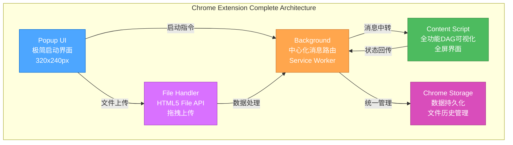

# 🎨 CREATIVE模式完成总结

## 🎯 创意阶段成果

### ✅ Level 3 CREATIVE验证清单
根据`visual-maps/creative-mode-map.mdc`指导，CREATIVE模式已完成：

- [x] **三个创意决策点全部完成** - 基于PLAN阶段标记的决策需求
- [x] **设计决策文档创建** - 每个决策点都有对应的creative-*.md文档
- [x] **选项分析详尽** - 每个决策都经过3个选项的全面分析
- [x] **决策理由充分** - 基于技术可行性、风险控制、开发效率等维度
- [x] **实施计划明确** - 提供具体的实现指导和技术细节
- [x] **验证清单完成** - 所有决策都经过功能、技术、安全性验证

## 🎨 三个核心创意决策

### 1. UI/UX设计决策 ✅

**选定方案**: 极简启动型Popup + 全功能Content Script

**关键决策**:
- Popup界面：320x240px，专注启动和基本管理
- Content Script：全屏DAG可视化，完整功能体验
- 设计一致性：统一的色彩、字体、交互规范

**决策理由**:
- 符合Chrome插件最佳实践
- 用户体验最佳，全屏可视化效果
- 技术复杂度合理，开发风险可控
- 扩展性强，未来功能主要在Content Script中

**实施准备**: ✅ UI布局设计、交互流程、视觉规范全部明确

### 2. 架构设计决策 ✅

**选定方案**: 中心化消息架构

**关键决策**:
- Background作为唯一消息路由中心
- 标准化消息协议和错误处理机制
- Chrome Storage API统一数据管理
- 完善的性能优化和安全策略

**决策理由**:
- 架构简单清晰，便于调试和维护
- 状态管理集中，数据一致性有保障
- 符合Level 3项目复杂度要求
- 大多数稳定Chrome插件的成熟模式

**实施准备**: ✅ 通信协议、数据流程、存储结构、错误处理全部设计完成

### 3. 文件操作策略 ✅

**选定方案**: HTML5 File API + 拖拽上传

**关键决策**:
- 使用成熟稳定的HTML5 File API
- 实现拖拽上传增强用户体验
- 多层次文件验证确保安全性
- 本地数据处理保护用户隐私

**决策理由**:
- 兼容性最佳，支持所有Chrome版本
- 实现简单，开发和维护成本低
- 用户熟悉度高，学习成本低
- 避免依赖新API，降低兼容性风险

**实施准备**: ✅ 文件处理流程、验证机制、存储策略、安全保护全部设计完成

## 📊 设计决策对比总结

| 决策维度 | UI/UX设计 | 架构设计 | 文件操作 |
|----------|-----------|----------|----------|
| **选择方案** | 极简启动型Popup | 中心化消息架构 | HTML5 File API |
| **复杂度** | Low | Medium | Low |
| **风险控制** | ⭐⭐⭐⭐ | ⭐⭐⭐⭐ | ⭐⭐⭐⭐⭐ |
| **用户体验** | ⭐⭐⭐⭐ | ⭐⭐⭐ | ⭐⭐⭐⭐ |
| **技术成熟度** | ⭐⭐⭐⭐⭐ | ⭐⭐⭐⭐ | ⭐⭐⭐⭐⭐ |
| **实施时间** | 1-2天 | 2-3天 | 1-2天 |

## 🏗️ 整体技术方案

### Chrome插件完整架构


### 核心技术栈确认
- **前端框架**: 原生JavaScript + SVG (零依赖)
- **Chrome API**: Extension API v3, Storage API, Tabs API
- **通信机制**: chrome.runtime.sendMessage + chrome.tabs.sendMessage
- **文件处理**: HTML5 File API + FileReader + Drag & Drop
- **数据存储**: Chrome Storage Local API
- **样式系统**: 原生CSS + Chrome插件规范

## 📋 IMPLEMENT阶段准备

### 实施路径规划
基于CREATIVE决策，IMPLEMENT阶段将按以下顺序进行：

**第一阶段：插件框架搭建** (1-2天)
1. 创建manifest.json配置文件
2. 实现Background Service Worker基础功能
3. 创建Popup HTML/CSS/JS基础结构
4. 建立基础的消息通信机制

**第二阶段：核心功能移植** (2-3天)
1. 从独立HTML版本重构核心可视化逻辑
2. 实现Content Script完整界面
3. 集成文件上传和处理功能
4. 实现Chrome Storage数据管理

**第三阶段：用户体验优化** (1-2天)
1. 完善UI/UX细节和交互效果
2. 优化性能和错误处理
3. 测试多标签页和状态同步
4. 准备Chrome Web Store发布

### 代码复用策略
- **最大化复用**: 独立HTML版本的DAG可视化核心逻辑
- **适配改造**: UI界面适配Chrome插件环境
- **功能增强**: 添加Chrome插件特有的功能支持
- **性能优化**: 针对插件环境的性能调优

### 质量保证计划
- **功能测试**: 确保所有核心功能正常运行
- **兼容性测试**: 验证在不同Chrome版本中的表现
- **性能测试**: 测试大型DAG文件的处理性能
- **安全测试**: 验证文件处理和数据存储的安全性

## ✅ CREATIVE模式里程碑

```
✓ CREATIVE模式验证清单全部完成
✓ 三个核心设计决策全部明确
✓ 每个决策都有详细的creative-*.md文档
✓ 技术方案完整性和可行性验证通过
✓ IMPLEMENT阶段实施计划制定完成

→ 准备进入IMPLEMENT模式
```

## 🔄 Memory Bank文档更新

### 创建的CREATIVE文档
1. **`memory-bank/creative/creative-chrome-plugin-ui.md`** - UI/UX设计决策
2. **`memory-bank/creative/creative-chrome-plugin-architecture.md`** - 架构设计决策
3. **`memory-bank/creative/creative-chrome-plugin-files.md`** - 文件操作策略
4. **`memory-bank/creative-summary.md`** - CREATIVE阶段总结

### 更新的核心文档
- **`memory-bank/activeContext.md`** - 反映CREATIVE完成状态
- **`memory-bank/progress.md`** - 更新项目进度和下一步计划
- **`memory-bank/tasks.md`** - 标记创意任务完成，准备实施任务

## 🚀 下一阶段：IMPLEMENT模式

根据Level 3工作流程，所有创意设计决策已完成，现在可以信心满满地进入**IMPLEMENT模式**：

1. **技术方案完全明确** - 所有关键技术决策都已做出
2. **实施路径清晰** - 三阶段实施计划详细制定
3. **风险充分识别** - 每个决策都考虑了风险控制
4. **代码复用最大化** - 基于验证通过的独立HTML版本

**CREATIVE阶段质量保证** ✅：
- 严格遵循Level 3 CREATIVE流程
- 所有决策都经过选项分析和验证
- 技术方案具有很强的可实施性
- 为IMPLEMENT阶段提供了清晰的指导

---

**📝 文档状态**: CREATIVE模式完成 ✅  
**📅 完成时间**: Chrome插件技术栈调整后  
**🎯 质量验证**: Level 3创意流程严格执行，设计决策全面覆盖 